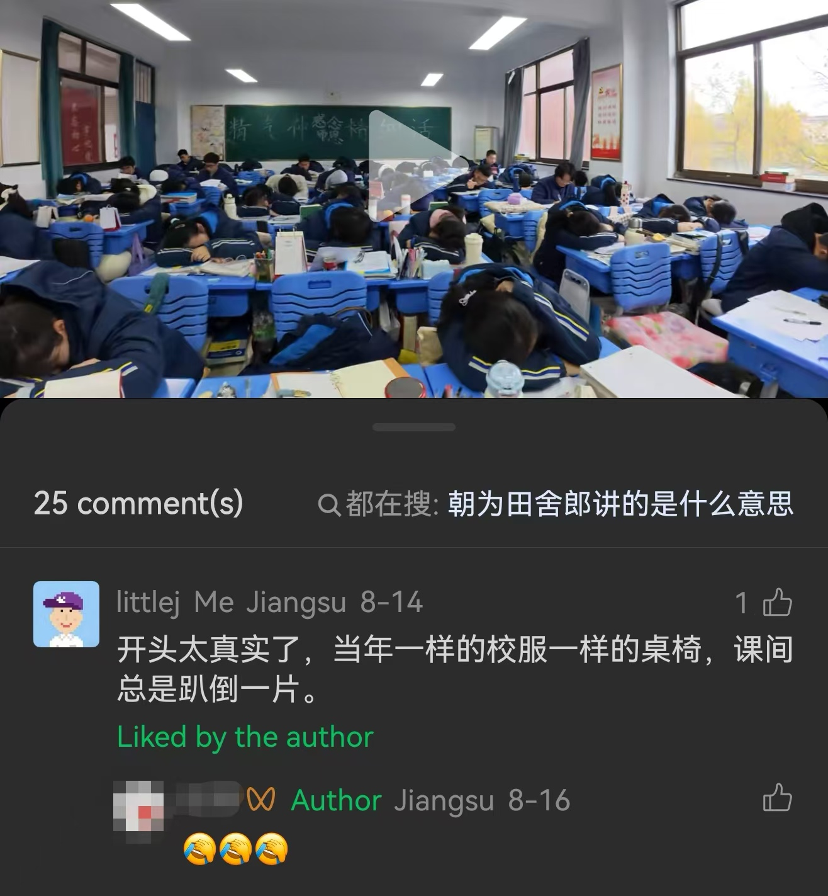
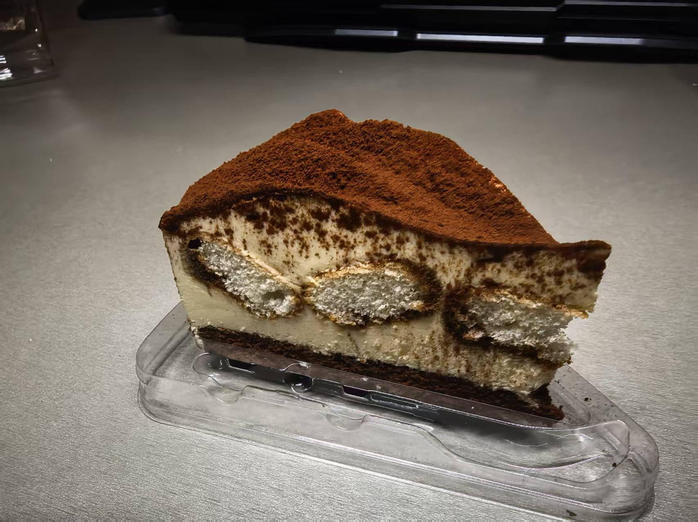

从鼓楼到仙林，地铁通勤需要将近一个小时。

头几次去仙林之前，我会想，这两小时我该「干点啥」呢？

第一想法居然是带点作业在路上写。当我意识到自己在想什么的时候，我绷不住了。还留着高中思维的惯性。

于是……我告诉自己，两小时的地铁其实可以什么也不干。就戴上耳机听听歌。或者干脆不戴耳机，听一听地铁的轰鸣与报站声。

---

在南大自由散漫惯了，总是在一些偶然的瞬间——比如听到特定几首歌的时候，或者赶早八的路上突然琢磨起高中早八在干什么的时候——惊讶地意识到，自己一年多以前还过过那种日子。

**比「被安排」更可怕的，是脑子里「安排」的本能。**

三年来早上六点半到夜里十点半，每周休息半天。

每天六点二十几往教室一坐，黑板上就是背诵任务。十点半放学了收作业。几乎每分每秒都是被安排好的。

以及，跑操回来到上课之间的 interval 可以做点什么？体育课要不要留在教室写作业？下节✕✕课不听 TA 讲，自己在底下干点什么？……这些自我安排也是被明里暗里鼓励的。

在那种氛围下，甚至 **不好意思** 显得放松。

---

> 以前你是一个高中生，是一个 **坐牢** —— 我把高中的生活描述成 **坐牢** ，应该还是相对恰当的——终于我现在到了一个不坐牢的环境里了，那我很容易启动一个 **改变** 的计划。
>
> （蒋炎岩，「成为 AI-Native 大学生」讲座，2026 年 9 月 12 日）

上周五，和队友约好晚上七点半组会，讨论周日怎么答辩。

下午五点熬完了软工二，到自习室坐下。想干点什么，可是感觉身心俱疲。

第一想法，是按照心里既定的「时间表」，在自习室坐到六点，然后买一份盒饭吃掉，再做事到七点半，去和队友见面。

转念一想，为什么累了还要本能地「熬」呢？

也许是在高中练出来的。一天在校 16 小时，上课累了跑不掉，晚自习累了也是撑着把作业做完，不然越积越多，以后还要补。

幸运的是，如今完全不是这种情况了。

立刻关掉电脑背上包跑回南园，在食堂吃了一碗热乎乎的汤面，回到宿舍换上睡衣躺在床上。还有一个多小时组会。我告诉自己，这一个小时不用集中任何精力，戴上耳机听听歌，跟 ChatGPT 聊聊天，如此便好。

七点半果然缓过来一些了，开开心心开组会。

---

这周出席了两次答辩，一次是自己讲，一次是看别人讲。

周日下午 EL Agent 组答辩，我们是唯一一组四人齐上阵。fgh 老师问及技术细节，鄙人也是当仁不让地对答如流了。整体还算顺利。大家还是很给力的！

周三下午是奖学金答辩。事实上我对奖学金一直没什么兴趣，并且也确实没有答辩的资格（）但是导员说可以观摩，我就去凑热闹了。

本来以为这种优绩主义的盛会多少会给自己一点压力，但是观摩完之后莫名地心情很好，很轻松，很愉悦，很释然。简直是一周当中情绪最好的时候，不知道是为什么。（心情好不需要理由！——心情好就是理由。）

（ps. 感谢 f 学长给我带的奶茶🧋 学长人太好了 🙏 ）

---

总之，学会休息。

我在实行自我的文艺复兴。

一直不觉得「坚持」「努力」之类的词汇，是做成什么事情的根本原因。**「热忱」才是。** 合理的逻辑应该是：

一个独一无二的**人** -> **天赋/特质** -> 针对特定事情的**热忱** -> **自发而愉悦**地花很多时间精力去做这些事情 -> 取得一些可见的**成果**。

很多环境中的一种误解，就是只重视最后两个环节，并且是从成果反推的，觉得「坚持」「努力」等等就是「成功的秘诀」，然后因为想要获得什么特定的成果所以去逼自己花很多时间和精力。

