终于有时间回顾七月底的上海之行。

对我来说，这是时隔十年的「故地重游」。

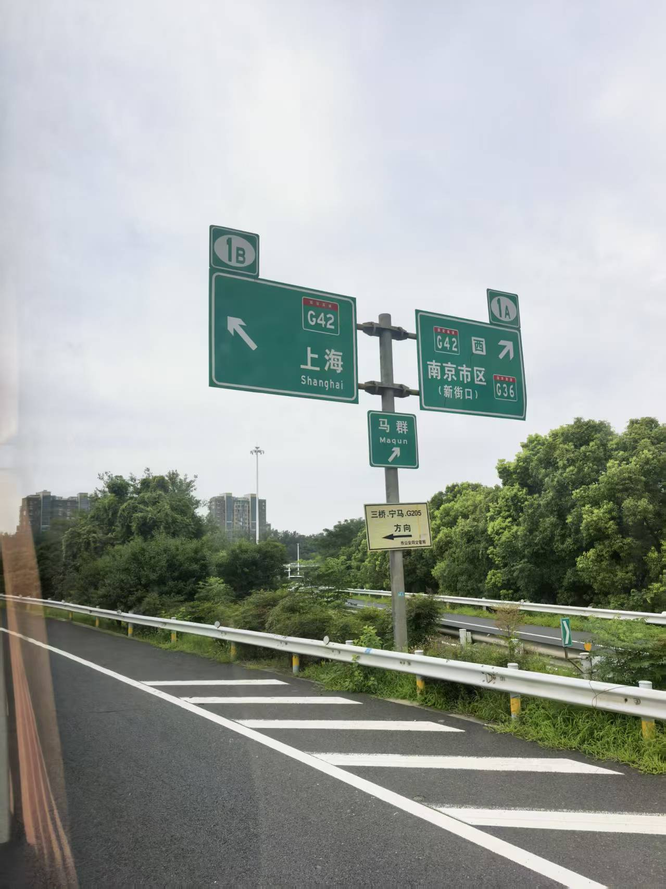

## 第一晚

手机导航不太灵，绕了好久，到五角场的一家商场吃晚饭。

这里似乎是刚结束的 BW 的分会场，二次元浓度很高。首先是辉夜的 BGM《告白》，然后是谷子店的满穗海报，分别把我带回了初三和高三……

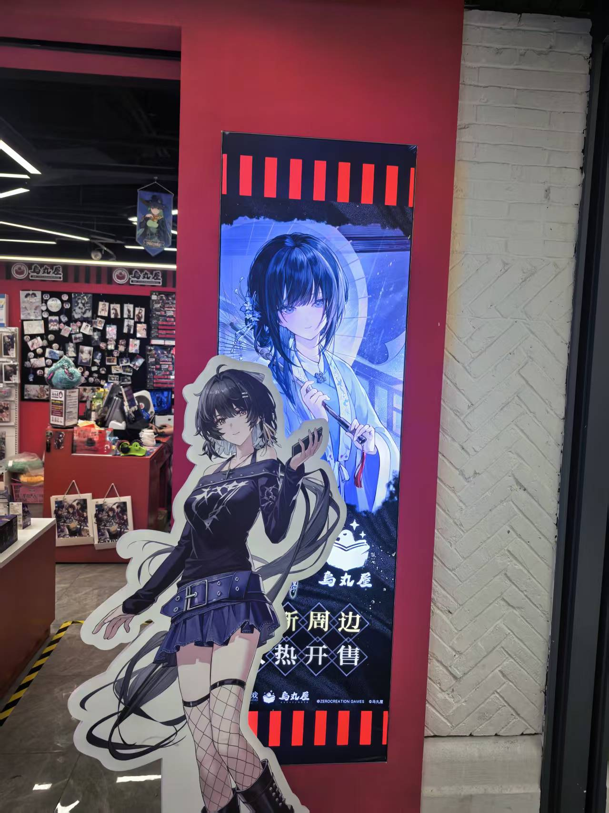

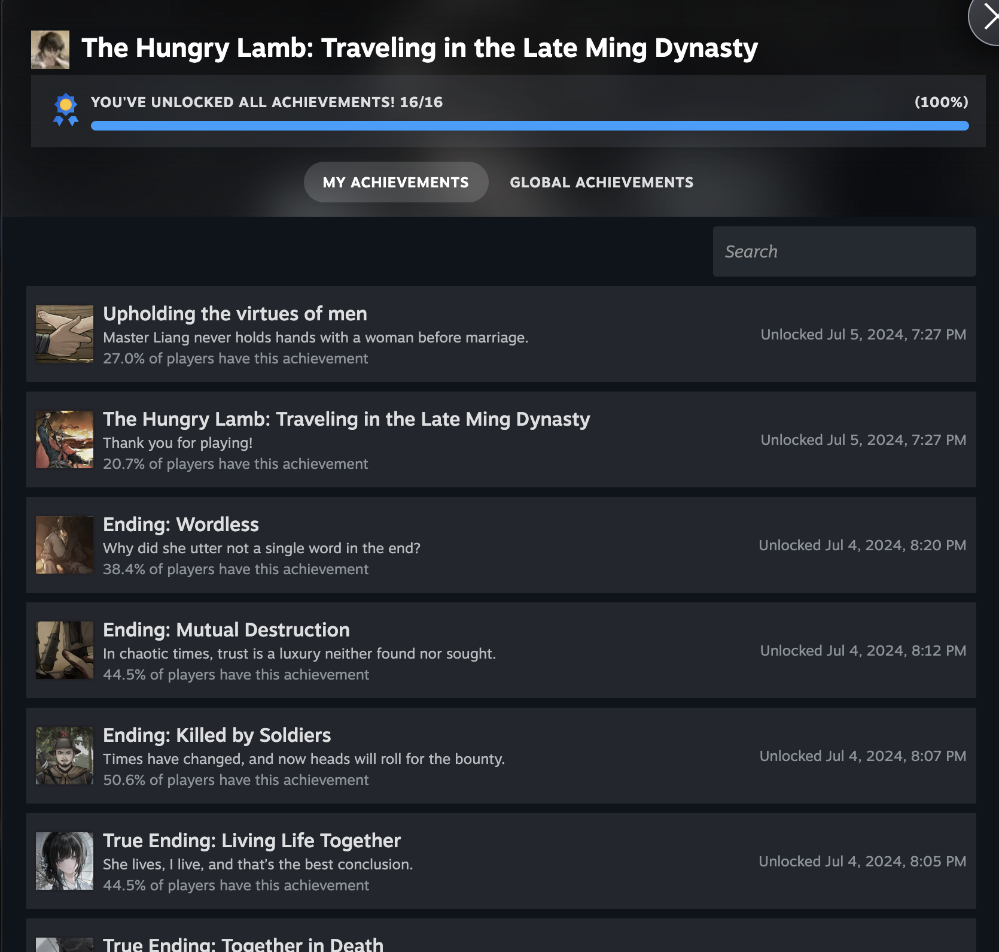

回到酒店意犹未尽。睡前过了一遍辉夜原声带专辑，感觉第二季那首插入曲的伴奏很适合做毕业典礼 BGM 啊（如果不考虑对应情节的话）。比如六月份书院的启程仪式暖场视频，我都想好怎么重组画面适配这首歌的节奏了——报到画面集中在开头，中间舒缓的部分是学期中各种活动的回忆，最后重新激昂的部分放合照和全体姓名滚动的小巧思。如果实在没事闲着，我真的会把素材拉出来配这首歌重剪一遍，虽然不可能有地方播放了（笑）。当时没想起来这首歌，所以用了跟开学典礼一致的 BGM，也好，有不忘初心、有始有终的寓意吧。

<iframe frameborder="no" border="0" marginwidth="0" marginheight="0" width=298 height=52 src="//music.163.com/outchain/player?type=2&id=1491883799&auto=0&height=32"></iframe>

也正是导航失灵，让人真的放下手机关注周遭。纵然身处高楼大厦车水马龙间，也有机会和能力穿行其中。从苏北到省会读书再到更大的城市参访，渺渺兮予怀。

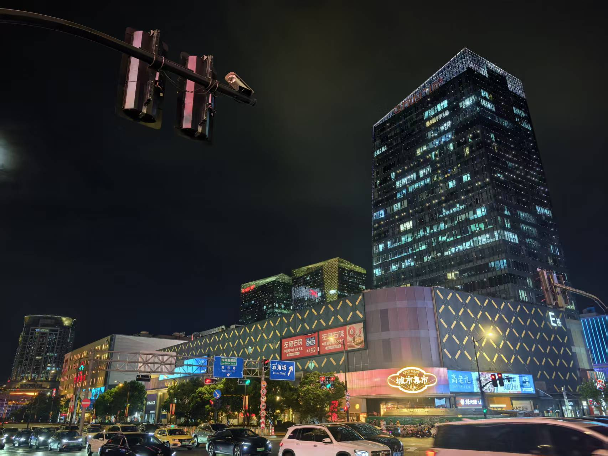

## 第二晚

小学三年级跟着父母来上海旅游，在外滩边上拍了张照片。

所以此行之前，我特意找出当年的原图，根据西侧几家银行推断出拍摄点位，准备抽时间拍一张十年后的版本。

### 咖喱 🍛

出发前，先在酒店附近解决晚饭。上 📕 搜了个小馆子。

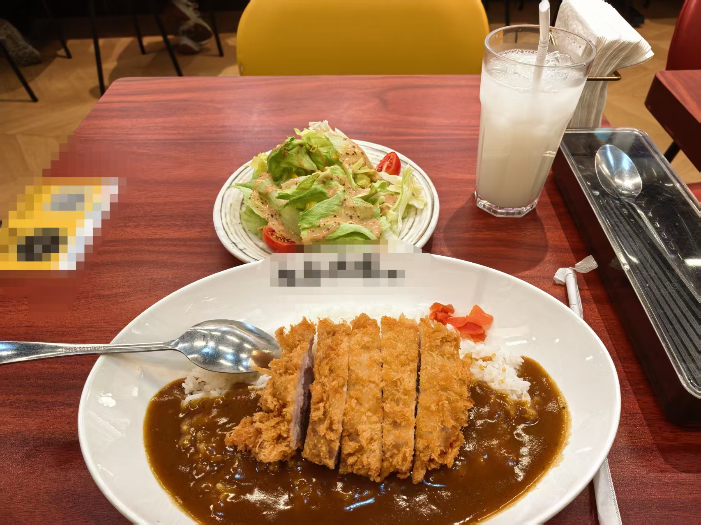

感觉还是喜欢高中北门的 15 块钱的咖喱猪排饭。老板娘是一位胖胖的阿姨，总是热情地招呼我们，问要放哪种酱。

小馆子放的歌倒是引起了我的注意。像是在欢快和繁华之中，融合了一层不可磨灭的细腻的忧思。挺符合此行的特质——在上海领略了五天之后，想怎样继续度过平常的日子呢？

<iframe frameborder="no" border="0" marginwidth="0" marginheight="0" width=298 height=52 src="//music.163.com/outchain/player?type=2&id=22636646&auto=0&height=32"></iframe>

### 外滩

走上著名的南京东路。虽然是工作日晚上，却也有无数的人。

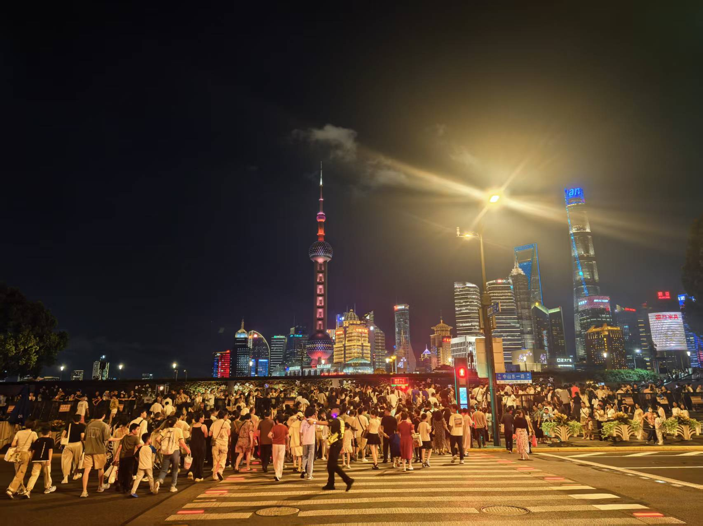

好在上了观景平台，人就少一些了。当年的我，怎么会想到十年之后会重新涉足这片平台呢？而且是以全新的身份和事由。

回去的路上，顺便逛了地铁站旁边的泡泡玛特。不愧是泡泡玛特，人真多。周围的店铺明显冷清不少。

## 第三晚

第三天下午结束得早，于是坐了两小时的地铁去交大闵行校区参观。

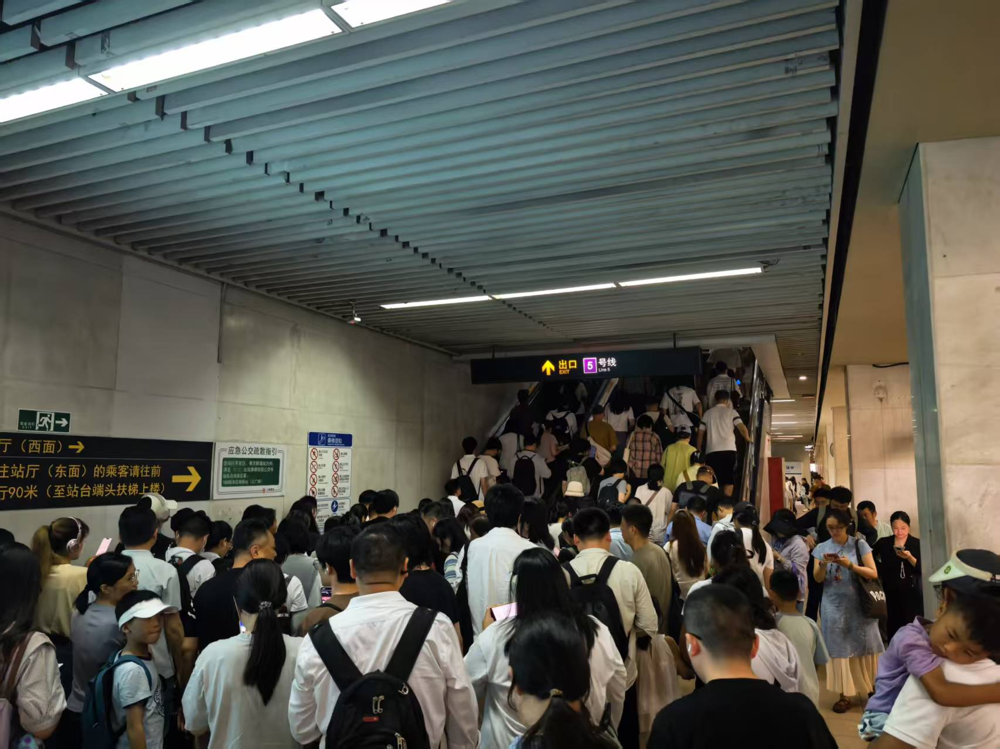

在同学的同学的推荐下，来到四餐二楼的西餐厅。芝士金枪鱼焗饭，味道挺好的。

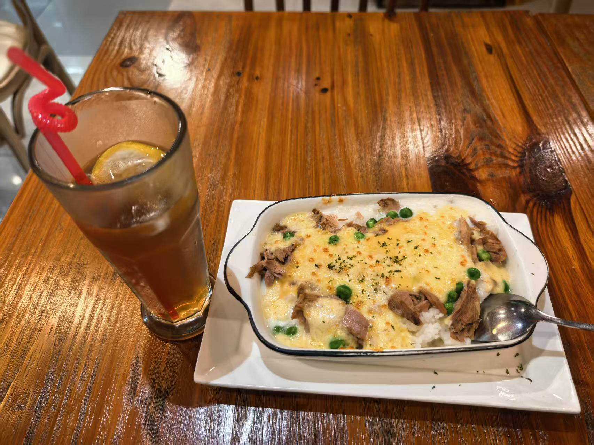

然后在校园里转悠。~~转悠的同时发现软工 2 出分了。~~

走着走着到了湖边。在校园里有一片水，真的会让氛围很好。让我想到了东大牌区礼堂前的喷泉，以及南大仙林校区的藜照湖。

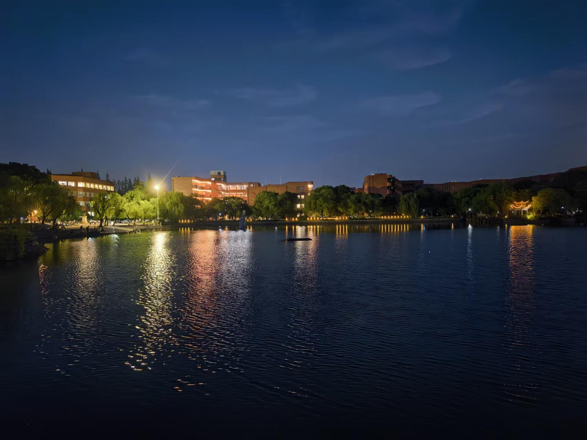

看时间不早了，于是扫了辆共享单车（居然正是第二天要参访的品牌）去友院打卡。

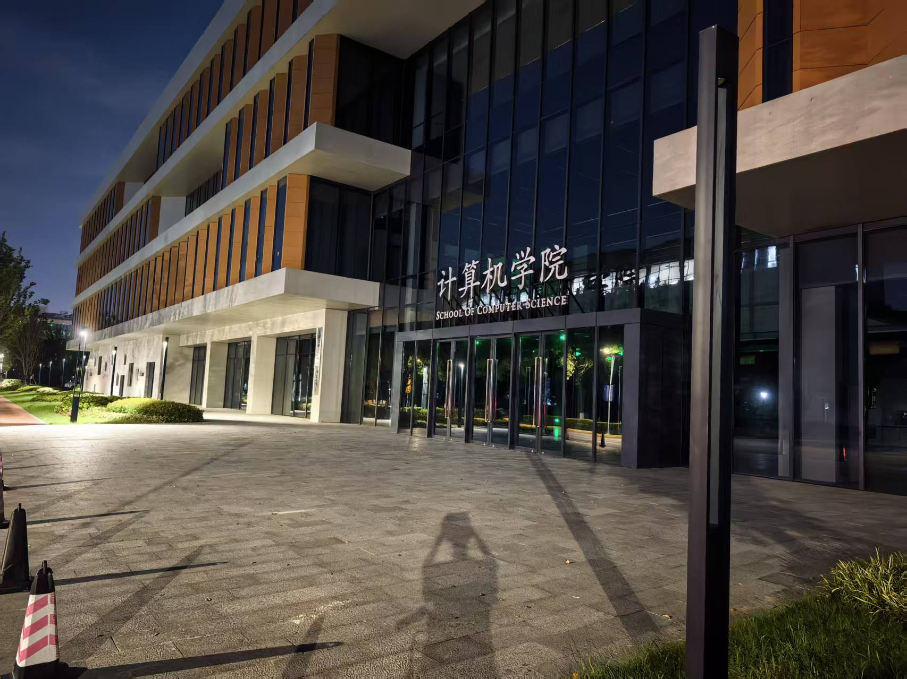

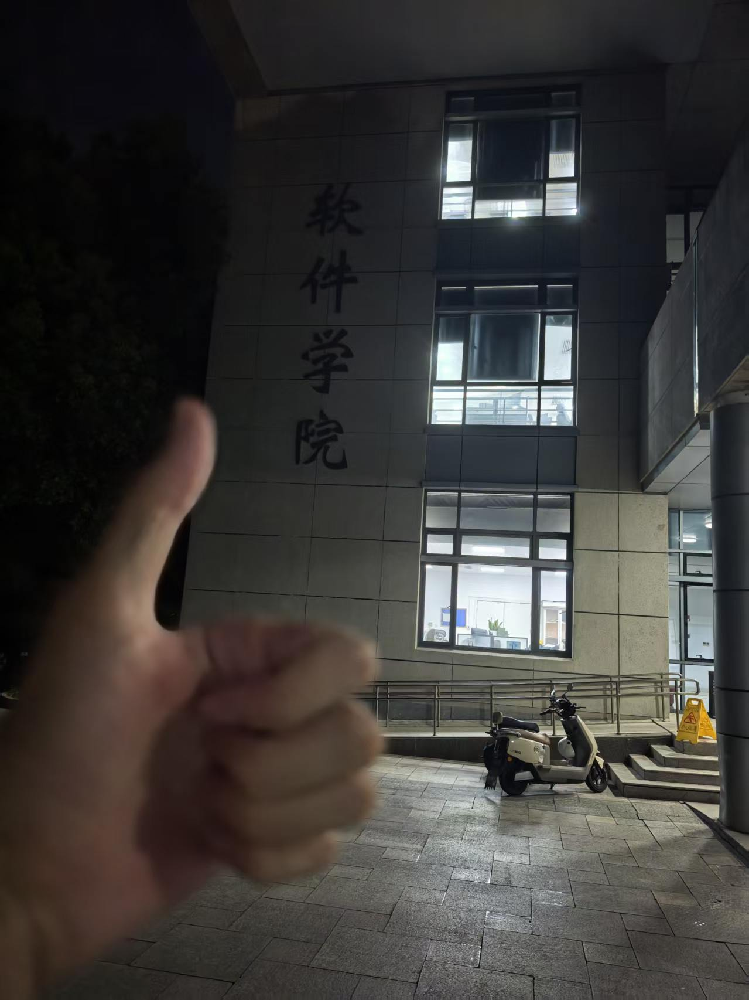

然后又是两小时的地铁。

## 第四晚

没想到返程前最后一晚结束得更早。可惜人已有些疲惫，只去近处的同济和复旦打了卡。

同济的建筑好看。

总之，看了这么多学校，欣赏的同时，内心还是喜欢自己的南大。校园氛围各不相同，我想南大就很适合我这样自由散漫地生长。在按照数字录取的规则下进入一所情投意合的高校，实乃幸运。

## 第五晚

五天的行程都是艳阳高照，踏上归途时下了雨。

车开到苏州一段时，还下了冰雹，被迫压低速度。

到了无锡附近，终于放晴了。

驶入城区，街景渐渐熟悉，又回到熟悉的鼓楼校园。

可是我不能久留——拉着行李箱，匆匆去赶回家的高铁。

这一路熟悉得不能再熟悉。

晚上十一点来到单元门口，过去熟视无睹的四个大字此刻那么耀眼——

「欢迎回家」。